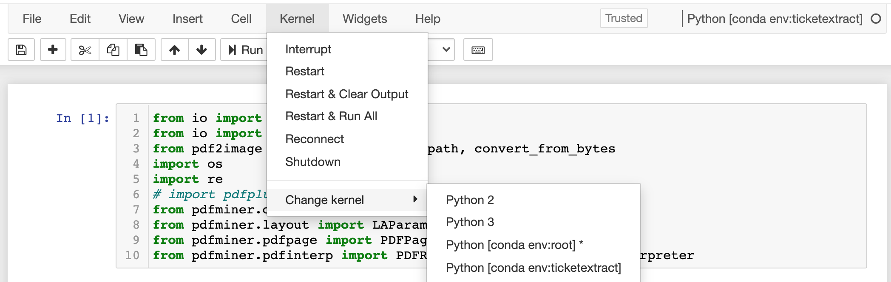

# Data Analysis List

[TOC]

## Data Preprocessing

### Data Imputation

1. [Python Package: fancyimpute](<https://pypi.org/project/fancyimpute/>)
2. [Multiple Imputation by Chained Equations: What is it and how does it work?](<https://www.ncbi.nlm.nih.gov/pmc/articles/PMC3074241/>)
3. [Imputing Missing Data with R:MICE package](<https://datascienceplus.com/imputing-missing-data-with-r-mice-package/>)


### Feature Scaling & Normalization

1. [About Feature Scaling and Normalization: and the effect of standardization for machine learning algorithms](http://sebastianraschka.com/Articles/2014_about_feature_scaling.html)
2. 


### Feature Engineering

1. [Discover Feature Engineering, How to Engineer Features and How to Get Good at It](https://machinelearningmastery.com/discover-feature-engineering-how-to-engineer-features-and-how-to-get-good-at-it/)
2. [使用Sklearn做单机特征工程](https://www.cnblogs.com/jasonfreak/p/5448385.html)
3. 


### Data Visualization

1. [How to Use t-SNE Effectively](https://distill.pub/2016/misread-tsne/)
2. [Clustering on the output of t-SNE](https://stats.stackexchange.com/questions/263539/clustering-on-the-output-of-t-sne)


## Classification Model

### Hyperparameter Tuning

1. [Hyperparameters in Deep Learning](https://towardsdatascience.com/hyperparameters-in-deep-learning-927f7b2084dd)
2. [k-Fold Cross-Validating Neural Networks](https://chrisalbon.com/deep_learning/keras/k-fold_cross-validating_neural_networks/) (tensorflow)
3. [Build a validation set with Keras](https://www.youtube.com/watch?v=dzoh8cfnvnI&feature=youtu.be)
4. [A guide to an efficient way to build neural network architectures- Part I: Hyper-parameter selection and tuning for Dense Networks using Hyperas on Fashion-MNIST](https://towardsdatascience.com/a-guide-to-an-efficient-way-to-build-neural-network-architectures-part-i-hyper-parameter-8129009f131b)
5. [Neural Network Tuning with TensorFlow](https://medium.com/computer-car/neural-network-tuning-with-tensorflow-cc14a23f132c)
6. [How to Grid Search Hyperparameters for Deep Learning Models in Python With Keras](https://machinelearningmastery.com/grid-search-hyperparameters-deep-learning-models-python-keras/)
7. [SVM Parameter Tuning in Scikit Learn using GridSearchCV](https://medium.com/@aneesha/svm-parameter-tuning-in-scikit-learn-using-gridsearchcv-2413c02125a0)
8. [Hyperparameter Tuning the Random Forest in Python](https://towardsdatascience.com/hyperparameter-tuning-the-random-forest-in-python-using-scikit-learn-28d2aa77dd74)
9. 


### Feature Importance

1. [Explaining Feature Importance by example of a Random Forest](https://towardsdatascience.com/explaining-feature-importance-by-example-of-a-random-forest-d9166011959e?fbclid=IwAR3upeiEWH4ombBTZHsT9L1_bwixBnxUaN_k-KYcZo27yyuVlki9CITgCMk)
2. 


##  Anomaly Detection

1. [5 Ways to Detect Outliers/Anomalies That Every Data Scientist Should Know (Python Code)](https://towardsdatascience.com/5-ways-to-detect-outliers-that-every-data-scientist-should-know-python-code-70a54335a623)
2. [Python Package: PyOD](<https://pyod.readthedocs.io/en/latest/>)


## Framework

1. [Keras vs Pytorch for Deep Learning](https://towardsdatascience.com/keras-vs-pytorch-for-deep-learning-a013cb63870d)


## Anaconda & Jupyter Notebook

### Manage conda environment

Assume currently we are in the default conda environment, named ``base``, and we want to create the ``env`` named ``ticketextract`` with ``python=3.6``, use command below in Terminal or Anaconda Prompt:

```shell
conda create -n ticketextract python=3.6 -y
```


After all installation done, to activate environment ``ticketextract`` in Terminal:

```shell
conda activate ticketextract
```

Then we are in the environment ``ticketextract``.

To deactivate environment ``ticketextract``:

```shell
conda deactivate
```

Then we are back into environment ``base`` again.


### Add anaconda ``env`` to Jupyter Notebook kernel

Assume currently we are in the default conda environment again, named ``base``, and we want to add the ``env`` in Jupyter Notebook kernel so we can use these environments in Jupyter Notebook.

In ``base``, install ``nb_conda_kernels``:

```shell
(base)$conda install nb_conda_kernels -y
```

In ``base``, install ``jupyter_contrib_nbextensions`` for jupyter notebook extensions:

```shell
(base)$conda install -c conda-forge jupyter_contrib_nbextensions -y
```

Now activate the ``env``, assuming named as ``ticketextract``, you want to add to Jupyter kernel, and install ``ipykernel`` in this environment:

```shell
(ticketextract)$conda install ipykernel -y
```

Now deactivate the ``ticketextract`` with ``conda deactivate``, and go back to the ``base``, in which you want to open Jupyter Notebook, type below in Terminal to open Jupyter Notebook:

```shell
(base)$jupyter notebook
```

Now you can see the kernel shown:



And here we can see that kernel of ``base`` is shown as ``root``.

> To conclude, install ``ipykernel`` in every environment you want to add to Jupyter kernel, and only install ``nb_conda_kernels`` in the environment you want to open Jupyter Notebook (usually it is ``base``)!!


## Others

1. [Here’s how you can get some free speed on your Python code with Numba](<https://towardsdatascience.com/heres-how-you-can-get-some-free-speed-on-your-python-code-with-numba-89fdc8249ef3>)
2. [Make your Pandas apply functions faster using Parallel Processing](<https://towardsdatascience.com/make-your-own-super-pandas-using-multiproc-1c04f41944a1>)
3. [GPU DataFrames: cudf, faster than pandas](https://github.com/rapidsai/cudf)
4. [Debugging and Profiling](https://missing.csail.mit.edu/2020/debugging-profiling/): Time & Memory consumption for Python script


